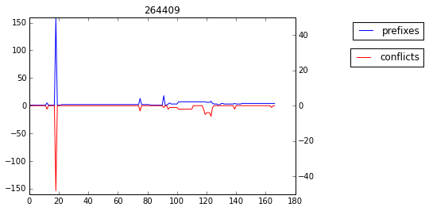

# Route Leak Detection

As of September 2018, this project is no longer maintained. It is kept available for reference but the repository will be archived read-only.

## Overview

This project intends to help detecting BGP fullview route leaks.  

A route leak occurs when an AS advertises, usually by accident, some prefixes it learned from 
others. As The BGP routing protocol does not include any security mechanism, the leak gets 
propagated. It can have a major impact since traffic will be directed toward the AS having made the 
leak instead of the legitimate AS. This phenomenon was noticed several times along the past years, 
sometimes impacting thousands of ASes. In order to identify route leaks, we defined a new 
methodology, and applied it on 2014, 2015 and 2016 BGP data. It successfully detected 6, 36 and 22 
route leaks, respectively. This represents tens of thousands of leaked prefixes each year. In 2016,
we detected that there are more than 11 000 conflicts due to route leaks.

The motivations, description and results are described in the article *Detecting Route Leak at Scale*.

This repository contains three different methods for route leak detection and the input data 
for 2014, 2015 and 2016.


## Authors

  * Julie Rossi <julie.rossi@ssi.gouv.fr>
  * Guillaume Valadon <guillaume.valadon@ssi.gouv.fr>
  
  
## Description
  
It contains the following directories:  

- data:  
Contains input data for 2014, 2015 and 2016.  
- functional\_testing:  
Some internal tools we use for testing.
- src:  
Contains the base codes of the different implementations
    - route\_leaks\_detection:    
    Two propositions of new methods to detect route leaks, one with heuristics, the other with machine learning. 
    Detailed description and usage are provided here after.    
    - deroleru:  
    The implementation of the heuristics algorithm in Rust used to speed up the process. The 
    Rust module is directly used in the python code of route\_leaks\_detection. A dedicated README 
    explain how it can be used directly.  
    - related\_work\_implem:  
    Proposition of implementation of an algorithm presented by researchers of university of Arizona in NANOG49 
    (https://www.nanog.org/meetings/nanog49/presentations/Tuesday/LRL-NANOG49.pdf). Dedicated README 
    is also available.

## Installation

*Prerequisite*:
It has been tested on Debian and Ubuntu, the following packages are needed:  
- python-dev python-pip virtualenv make
- To take advantage of the faster implementation, Rust should be installed:

```shell
curl https://sh.rustup.rs -sSf | sh
```

A Makefile is supplied to ease installation. It creates and install python packages in a virtual 
environment (in directory `env`) and installs rust package.  
Make sure you run the code using the virtualenv:

```shell
make
source env/bin/activate
export PYTHONPATH=$PWD
```

*Note*:
If Rust is not installed, you should run `make python` instead of `make`.

## Route Leaks Detection

This is the main package of the project. It contains two methods to detect route leaks: 
heuristics and classification (machine learning)

### input data

The input data is available for 2014, 2015 and 2016 in data directory.  
For each year two files are needed :

- conflicts: (one time series per AS) number of ASes in conflicts per day
- prefixes: (one time series per AS) number of prefixes announced per day

They are created using [TaBi](https://github.com/ANSSI-FR/tabi) 
and [MaBo](https://github.com/ANSSI-FR/mabo).

### Lexicon

**pfx:** shortcut for prefixes, refers to the BGP prefixes announced.  
**cfl:** shortcut for conflicts, refers to the BGP announces in conflicts with other announces.  

### Testing

For both methods, unit tests and functional tests are available.  

Heuristics unit tests:

```python
python -m pytest src/route_leaks_detection/heuristics/
```

Machine Learning unit tests:

```python
python -m pytest src/route_leaks_detection/classification/
```

Functional tests:

```python
python -m pytest src/route_leaks_detection/tests
```

You also can run all of them using:
```shell
make test
```

### Heuristics

Apply heuristics on data from prepare_data module.  

The algorithm looks for simultaneous peaks in the data. It is based on the following steps:  
For each AS  
- find peaks in prefixes data  
- find peaks in conflicts data  
- check if peaks found for prefixes and conflicts happen the same day  


Example of simultaneous peaks, hence considered as a fullview leak (index 19):  



**how to use:**  

There are two possibilities, using FindRouteLeaks (from detect\_route\_leaks module) or 
FittedFindRouteLeaks (from detect\_route\_leaks\_optimized).   
The first one uses default parameters while the second one will calculate them based on the data.
FindRouteLeaks will be faster but the results may be less interesting.  

```
detect_route_leaks --help  
 
usage: detect_route_leaks.py [-h] [--out OUT]
                             [--pfx_peak_min_value PFX_PEAK_MIN_VALUE]
                             [--cfl_peak_min_value CFL_PEAK_MIN_VALUE]
                             [--max_nb_peaks MAX_NB_PEAKS]
                             [--percent_similarity PERCENT_SIMILARITY]
                             [--percent_std PERCENT_STD] [--fit_params]
                             pfx_file cfl_file

positional arguments:
  pfx_file              full path of file with prefixes data 
  cfl_file              full path of file with conflicts data

optional arguments:
  -h, --help            show this help message and exit
  --out OUT             full path of file where results will be saved - default stdout
  --pfx_peak_min_value PFX_PEAK_MIN_VALUE   heuristics parameter
  --cfl_peak_min_value CFL_PEAK_MIN_VALUE   heuristics parameter
  --max_nb_peaks MAX_NB_PEAKS               heuristics parameter
  --percent_similarity PERCENT_SIMILARITY   heuristics parameter
  --percent_std PERCENT_STD                 heuristics parameter
  --fit_params          if specified, best params will be calculated (when not
                        given) before running the detection.
```


**output:**

Print leaks found on stdout.  
Format:  

```
{asn: {"leaks": [indexes in data where leak is detected],
       "pref_data": [prefixes data from prepare_data for asn],
       "conf_data": [conflicts data from prepare_data for asn]}}
```
    
     
### Classification

Apply Machine Learning (SVM classifier) on data from prepare_data module using proposed model.  


**How To Use:**  

```
./src/route_leaks_detection/classification/classification.py --help

usage: Detect alleged fullview leaks using Machine Learning
       [-h] pfx_file cfl_file

positional arguments:
  pfx_file    full path of file with prefixes data 
  cfl_file    full path of file with conflicts data 

optional arguments:
  -h, --help  show this help message and exit
```


**Attributes:**

A few definitions of the concepts used:  
'Variation' means the difference between one element of the time series and its previous value.  
'Correlation' is the series obtained by multiplying for each index the values of the two series. 
It is a series with the same dimension as the other two.  
When specified 'for both prefixes and conflicts", there are two attributes, one calculated on 
prefixes series, the other calculated of the conflicts series.  

Here are the attributes used for the classification.  

- `max_var` for both prefixes and conflicts  
The biggest value of the time series normalized variation .  
- `next_var` for both prefixes and conflicts  
The value of variation that comes just after the biggest variation.  
- `max_other_var` for both prefixes and conflicts  
The value of the variation of the other series (conflicts if prefixes is treated, prefixes 
if conflicts is treated) at the point of the biggest variation of the series.   
- `next_other_var` for both prefixes and conflicts  
The value if the variation of the other series at the point that comes just after the biggest variation.    
- `nb_maxes` for both prefixes and conflicts  
Percent of values greater or equal than 0.9 times the series maximum value.  
- `std_ratio` for prefixes, conflicts and correlation  
Ratio between the standard deviation calculated without the maximum value and the actual standard deviation.  
- `other_std_ratio` both prefixes and conflicts  
Same as `std_ratio` but the point removed to calculate the partial standard deviations are calculated 
for the other series (the point remove for the partial standard deviation is however the index of the maximum 
value of the series treated, not the one on which the standard deviation is calculated).  
- `last_decile` for prefixes, conflicts and correlation    
Last decile value (a decile is any of the nine values that divide the sorted data into ten equal 
parts, so that each part represents 1/10 of the sample).  
- `last_decile_spread` for prefixes, conflicts and correlation    
Ratio between the spread of the last decile (index of the last element of the decile minus the 
index of the first element of the decile) and the data length.  
- `last_quartile` for prefixes, conflicts and correlation    
Same as `last_decile` for quartile (divide data into four equal parts).    
- `last_quartile_spread` for prefixes, conflicts and correlation    
Same as `last_decile_spread` for quartile.  
- `percent_above_average` for prefixes, conflicts and correlation    
Percent of points in data that are bigger than the average.  
- `log_max_var` for both prefixes and conflicts  
Logarithm of value of variation matching biggest value in raw data.  
- `corr_max_value`  
Logarithm of the maximum value of the correlation series.  
- `corr_max_next`  
The value of the correlation that comes just after its biggest variation.
- `corr_nb_maxes`  
Same as `nb_maxes` for correlation series.  
